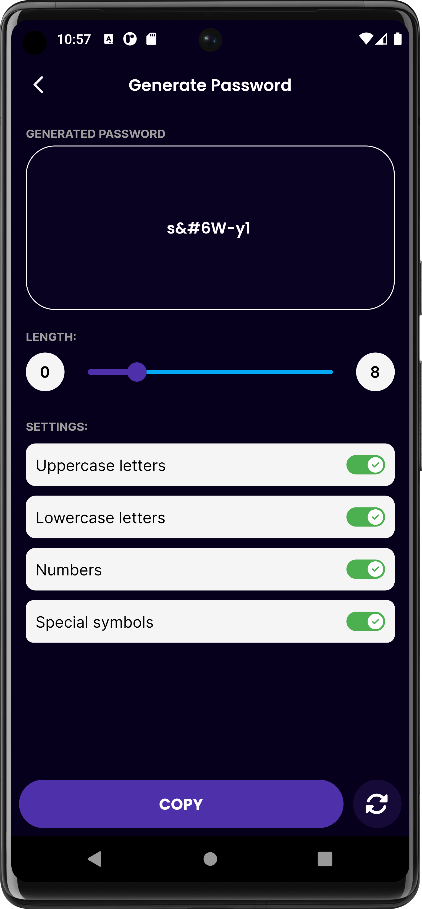

# Pass Guard

Password Manager Mini Project 

[//]: # (## Table of Contents)

[//]: # ()
[//]: # (- [Installation]&#40;#installation&#41;)

[//]: # (- [Usage]&#40;#usage&#41;)

[//]: # (- [Features]&#40;#features&#41;)

[//]: # (- [Contributing]&#40;#contributing&#41;)

[//]: # (- [License]&#40;#license&#41;)

[//]: # ()
[//]: # (## Installation)

[//]: # ()
[//]: # (Instructions on how to install and set up the project.)

[//]: # ()
[//]: # (## Usage)

[//]: # ()
[//]: # (Instructions on how to use the project or provide code examples.)

[//]: # ()
[//]: # (## Features)

[//]: # ()
[//]: # (List of key features or highlights of the project.)

[//]: # ()
[//]: # (## Contributing)

[//]: # ()
[//]: # (Guidelines on how to contribute to the project or how to set up a development environment.)

[//]: # ()
[//]: # (## License)

[//]: # ()
[//]: # (Information about the project's license.)

## Screenshots

![Screenshot 1]
Initial Screen

![Screenshot 2]
Login Screen

![Screenshot 3]
Home Screen

![Screenshot 4]
Profile

![Screenshot 5]
Security Screen

![Screenshot 6]
Generate Password

![Screenshot 7]
Backup data